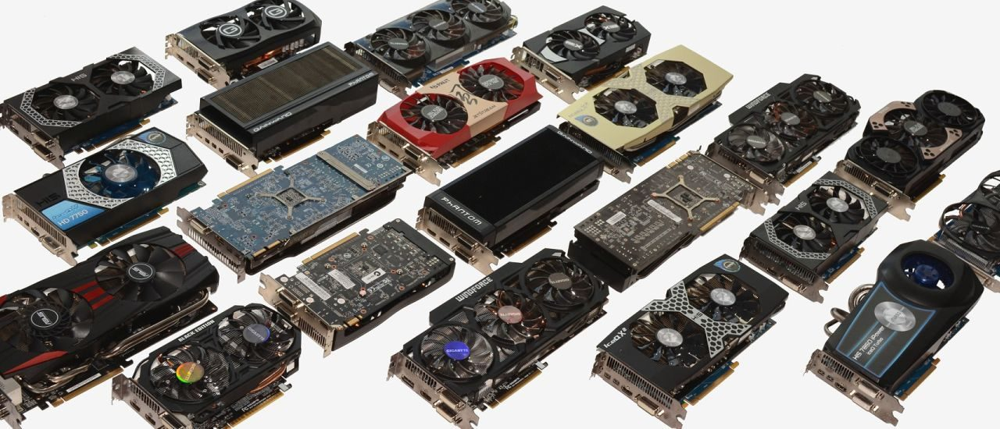
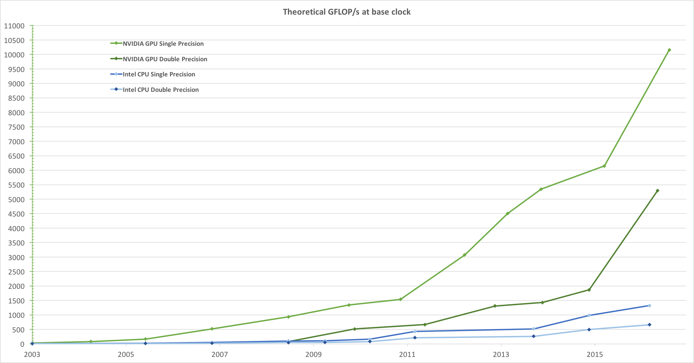
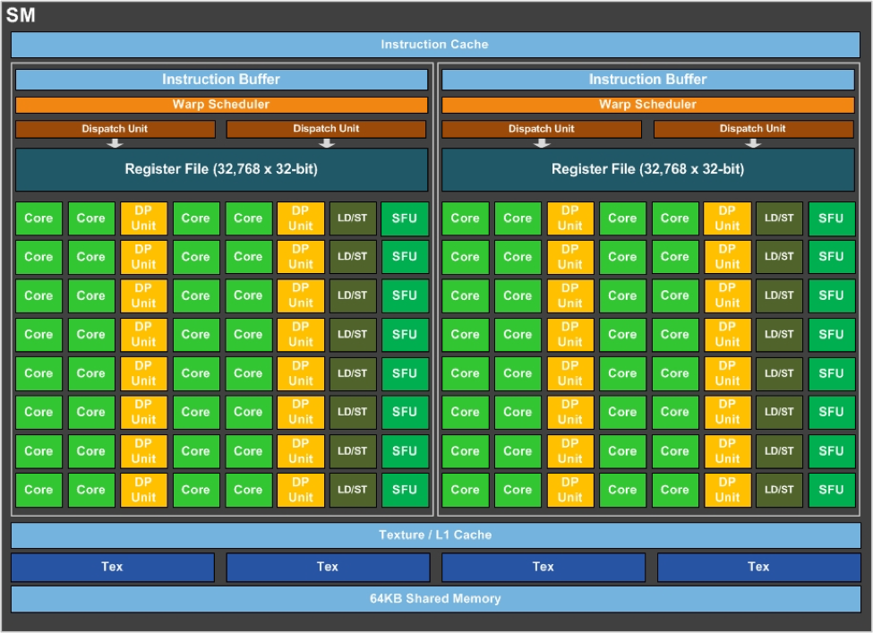
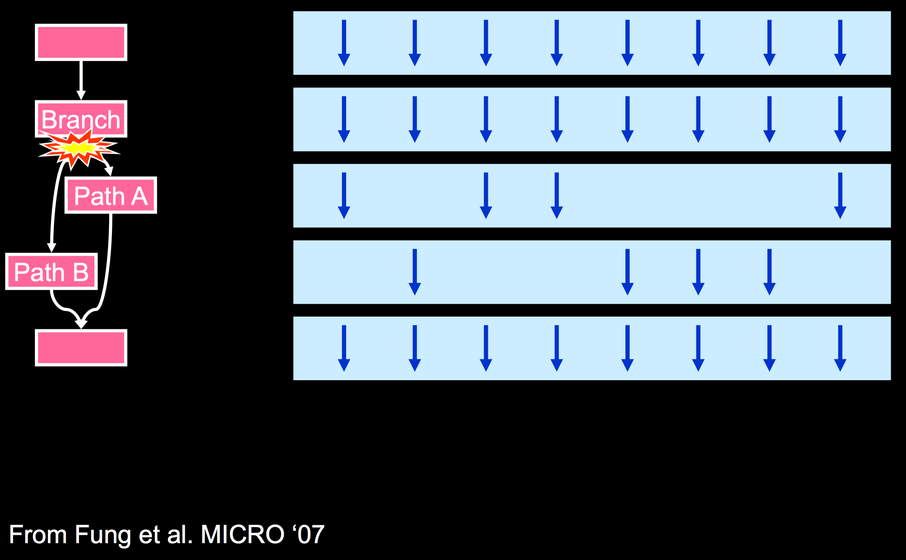
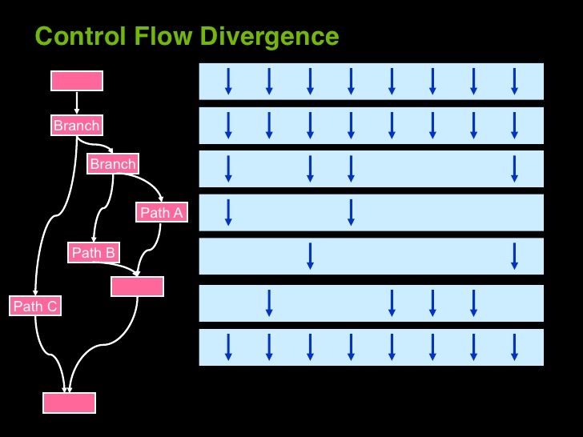

# GPU Programming 101

### Doing parallel programming is really easy, as long as you don't need it to run fast

---
## What is a GPU?

>A graphics processor unit (GPU), is a specialized electronic circuit designed to rapidly manipulate and alter memory to accelerate the creation of images in a frame buffer intended for output to a display. GPUs are used in embedded systems, mobile phones, personal computers, workstations, and game consoles.

--- 
## What is a GPU?

>Modern GPUs are very efficient at manipulating computer graphics and image processing, and their highly parallel structure makes them more efficient than general-purpose CPUs for algorithms where the processing of large blocks of data is done in parallel.

---
## What is a GPU?
>In a personal computer, a GPU can be present on a video card, or it can be embedded on the motherboard or—in certain CPUs—on the CPU die.

---



---
## What is a CPU?
@ul
- small # of complex, independent cores
- hyper-threading
- cache hierarchy
- may have an _integrated_ GPU
- branch prediction & speculative execution
- SIMD-ification
- ILP
- OoO execution & register renaming
@ulend

---
## What is a CPU?
> Not only are CPUs good at running code, but they are good at running _bad_ code.

---
## What is a CPU?
@ul
- Moore's law - it's about transistor count, not speed
- a "wall" is hit around 2005
- limited memory bandwidth
- power consumption & complexity
@ulend

---
## What is GPGPU?

- using GPUs for general-purpose programming
- gets mainstream after 2008
- different than GPU programming for games (even the architecture shows)

---


---


---


---
- GPUs are well-suited for data-parallel computations with high arithmetic intensity
- (this is the ratio of arithmetic operations to memory operations)
- => lower requirement for sophisticated flow control
- => memory access latency can be hidden with calculations instead of big data caches
- optimised for simple tasks & throughput

--- 
## Some terminology
@ul
- latency: how fast can a car go on this road
- bandwidth: how many cars at time
- throughput: how many cars can per hour
- what are CPUs optimised for?
@ulend

---
## Performance = Parallelism
## Efficiency = Locality

---
### The GPU is a huge SIMD machine for embarassingly parallel tasks - like CG/ML/HPC

---
## Programming model
- Cache hierarchy & explicit memory labeling
- Each SIMD lane is a different thread (~SIMT)
- Write the program as if only **one** SIMD lane will execute it
- Run it on **thousands** of threads simultaneously
- Have each thread operate on a different piece of data

---
## Programming model
- Synchronization is limited => don't have to worry about it
- Tasks that require synchronization are harder (or impossible)
- If a task cannot be split into blocks, maybe it's not suitable

---
## GPGPU APIs
Each API has two parts:
- C/C++ API to send tasks & data to the device
- C-based language for writing programs for the device

---
## GPGPU APIs
- OpenCL (Khronos) - **everywhere**
- Metal (Apple) - OSX & iOS
- Direct Compute (Microsoft) - Windows
- CUDA (nVidia) - nVidia
- RenderScript (Google) - Android

---
## GPGPU API Goals
- use (almost) all computational resources
- based on a familiar language (C/C++)
- data- & task-parallel computational model
- abstract the specifics of the underlying hardware

---
## GPGPU APIs
Each API has the notion of a host & some devices.


---
## Simple workflow example: Sum
```c++
void sum(float* a, float* b, float* res, int count) { 
    for (int i = 0; i < count; ++i)
        res[i] = a[i] + b[i]
}
// ...
sum(a, b, res, count);
```

---
## Simple workflow example: Sum
```c
__global__ void sum(float* a, float* b, float* res, int count) {
    int i = get_global_id();
    if (i > count) return;
    res[i] = a[i] + b[i];
}
// ...
// transfer a,b to device
sum<<<1,N>>>(a, b, res, count)
// transfer res back to host
```

---
# Device Thread Model

---
## Device Thread Model
- have a parallel problem <sup>(obviously)</sup>
- write a program as if only **one** thread will execute it
- each thread receives an **unique ID**
- each thread can fetch unique data to work on

---
## Device Thread Model
- threads are grouped into **warps**
- all threads in a warp execute in lock-step (true SIMD)
- some call it SIMT - perhaps more appropriate
- each warp has 32 threads
- some of the problems of CPU SIMD-ification are solved

---
## Device Thread Model
- on a higher level, threads are grouped in blocks
- threads within a block can communicate by shared memory
- #threads per block configurable for each kernel call
- \# of blocks usually determined by the amount of work
- max threads per block = 1024
- each thread has a 3D index in the block it belongs to

---
## Device Thread Model
- blocks of threads are groupes in grids
- each grid corresponds to a single kernel call
- communication between blocks is tough
- synchronization is tougher
- practically no limit on #blocks per grid (modulo dimensionality)
- each block also has a 3D index in the grid it belongs to

---


---
## Device Thread Model
Some considerations:
- \# of threads in block should be a multiple of 32
- 512 or 16x16 is usually a good choice
- 1D/2D/3D organization is up to the programmer
- \# of blocks can be large (but measure carefully)

---
>One accurate measurement is worth a thousand expert opinions.

---
## Device Thread Model



---
## Device Thread Model
- each block is assigned to an SM
- an SM can have multiple blocks concurrently
- done by the hardware
- blocks may run in any order => must be independent

---


---
## Device Thread Model
The catch: each operation has much higher latency on the GPU than the CPU, especially memory accesses.

So, block execution is interleaved in order to **hide the latency with multithreading.**

---


---


---
## Device Thread Model
- context switching between blocks is fast, since registers & shared memory do not need to be saved/restored
- with enough blocks in one SM latency can "disappear"
- occupancy (def.): active threads / max active threads
- modern GPUs support 2048 threads per SM => that's a lot of blocks
- probably best to have 4-8 blocks per SM
- => increases register pressure & may lead to spillage (more on that later)
- as in CPU, ILP is an alternative to higher occupancy

---


---


---

## Divergence
What will happen on execution of the following:
```c
__global__ void squareEvenOdd(int* a, int count) {
    int id = globalThreadIdx();
    if (id >= count)
        return;
    if (id % 2)
        a[id] = a[id] * a[id];
    else 
        a[id] = 0;
}
```

---


---


---


---
## Divergence - Solutions
- ignore - sometimes the only solution
- multi kernel
- group identical tasks together

---
## Difference between the CPU and the GPU thread models 

| CPU        | GPU           |
| ------------- |:-------------:| 
| Threads are expensive, no sense to have more threads than cores | Threads are cheap, make millions | 
| Context switch is expensive     | Cheap, happens every couple of cycles| 
| Branch can be expensive, but most of the time is cheap | Most often, branches are really expensive  | 
| Writing a lot code does not hurt the performance | Writing a lot code **might** hurt the performance |

---
# Memory Model

---
## Memory Model

Device(s) and host have physically separate memory.
We have to copy it back and forth (think memcpy).


---
## Memory Model

- the host can access device memory, the reverse isn't possible
- all allocations are done by the host
- no virtualization (all addresses are physical)
- data lifetime is from allocation to deallocation

---
## Memory Model

- registers
- shared memory
- global memory
- constant memory
- Other: caches, "local", broadcast

---


---


---
## Registers
```c
int foo;
float bar[196]; // not (!)
Widget widget;
void baz(float fizzBuzz) { // <-
    ...
}
```
- each thread has its own view
- probably the most valuable resource

---
## Registers

- they run out when `threads/block * registers/thread` becomes too large
- on every function call, registers are "preallocated"
- if we have multiple branches, the maximum is preallocated
- when the registers get full, they "spill" in global memory
  - more specifically, a part of it, called `local` memory
  - in OpenCL, `local` memory means something else => confusion ensues
- which register will be spilled is unknown to the programmer
- the compiler will try to avoid spillage

---
## Shared memory
```c
__shared__ int x;
__shared__ int arr[42];
```
- a block of threads have the same view
- different blocks have different views
- the root of most optimizations is using shared memory better
- idea - manually cache what you need and use it instead of global memory

---
## Global memory
```c
__global__ int y;
float bar[196]; // (!)
```
- all threads have the same view
- most GPGPU apps are struggling with using it

---
## Constant memory
```c
__constant__ float pi = 3.14f;
__constant__ int c[42];
```
- all threads have the same view (of course)
- fast only if all threads in a warp access the same value
- otherwise, slow (although being cached)

---


---


---
## Registers, cont.
- registers are finite & may limit occupancy
- it's the function calls that flush registers to memory (slow)
  - that makes recursion is impractical
  - virtual functions are also a no-no
- inlining functions leads to faster execution, but higher register pressure
- sometimes having a function call is worth it (\_\_noinline__)
- some programming guides advise against it => try, at least

---
## Shared memory, cont.
- shared memory is divided in 32 banks
  - bank `i` contains all `addr%32 == i`
- accesses to the same bank are serialized
- when consecutive threads access consecutive addresses, they are coalesced into one memory read
- this is true for global memory, too

---
## Good memory access pattern:
```c
__global__ void good_kernel(float* arr) {
  // ...
  const int tid = globalThreadIdx();
  arr[tid] = threadIdx.x;
}
```
- even better when all warp accesses fit into the same cache line
- the cache line is 128B = 32 * sizeof(float)
- remember the GPU being optimized for single-precision calculations?

---
## Bad memory access pattern:
```c
__global__ void bad_kernel(float* arr) {
 const int tid = globalThreadIdx();
 arr[1000*tid] = threadIdx.x;
}
```
- each access involves a different cache line and the pattern is hard to predict => poor performance
- also known as memory "scatter" of "gather"

---
## Misaligned memory access pattern:
```c
__global__ void offsetCopy(float* A, float* B, int offset)
{
  int i = globalThreadIdx() + offset;
  A[i] = B[i];
}
```


---
## Misaligned memory access pattern:


---
## Strided memory access pattern:
```c
__global__ void strideCopy(float* A, float* B, int stride)
{
  int i = globalThreadIdx() * stride;
  A[i] = B[i];
}
```


---
## Strided memory access pattern:


--- 
## Some more considerations:
- maximum register count is a parameter
  - useful to see whether it has an effect on bigger kernels
- random reads from global memory is slow
- random reads from constant memory are even slower (!)
- almost all of the time the application is memory bound
- sometimes re-calculating is better than caching

---
# CUDA C(++)

>Within C++, there is a much smaller and cleaner language struggling to get out. - Bjarne Stroustrup

---
## CUDA C
- extends C with function & variable qualifiers
- a directive for executing kernels on the device
- four built-in variables for block/thread dimensions & indices
- built-in vector types from basic integral and floating point types

---
## Built-in vector types:
- `int1, int2, int3, int4`
  - for all integral types <= 4B
- `longlong1,longlong2`
  - for all 8B integral types 
- `float1,float2,float3,float4`
- `double1,double2`
- `dim3` the same as `int3`
- all simple structures:
```c
struct float4 { float x,y,z,w; };
int2 make_int2(int x, int y); // "constructor", all types have one
```

---
## Built-in vector types
```c
dim3 dimBlock(width, height);
dim3 dimGrid(10); // same as (10,1,1)
f<<<dimGrid,dimBlock>>>(...);
f<<<10,512>>>(...);
// ...
__device__ int globalThreadIdx() {
  return blockIdx.x*blockDim.x + threadIdx.x; // for 1D
}
```

---
## Built-in variables
```c
dim3 gridDim;   // grid dimensions
dim3 blockID;   // block index within the grid
dim3 blockDim;  // block dimensions
dim3 threadIdx; // thread index within the block
```
- assigning new values is forbidden
- taking their addresses is also forbidden

---
## Function qualifiers
```c
__device__ float deviceFunc() { return 42.f; }
__global__ void globalFunc() {
  float x = deviceFunc();
}
__host__ float hostFunc() {
  globalFunc<<<4,128>>>();
}
```
- `__device__`: called from device, executes on device
- `__global__`: called from host (the special way), executes on device
- `__host__`: called from host, executes on host

---
## Function qualifiers
- limited recursion, no static variables, no variadic arguments
- can't take an address of a `__device__` function
- `__host__` and `__device__` can be used together, the others not
- `__global__` function must have void return type
- execution configuration for `__global__`s must be specified, and the call is asynchronous

---
## Memory management functions:
- `cudaMalloc()` - gives a device address to a host pointer
- `cudaMallocPitch()` - allows for "row" padding
- `cudaFree()`
- `cudaMemset()`
- `cudaMemcpy()` - for two-way transfers
- `cudaMemcpyToSymbol()` - used to set `__constant__` variables
- all of those are synchronous & wait for the currently executing kernels to complete
- all of those also have async versions (to be used with care)

---
## Example usage:
```c
int main() {
  float* A = ...;
  float* B = ...;
  float* dev_A = nullptr; // pointer to device memory
  float* dev_B = nullptr; // pointer to device memory
  // transfer to device
  cudaMalloc((void**)&dev_A, n*sizeof(float));
  cudaMemcpy(devPtrA, A, n*sizeof(float), cudaMemcpyHostToDevice);
  cudaMalloc((void**)&dev_B, n*sizeof(float));
  cudaMemCpy(devPtrB, B, m*sizeof(float), cudaMemcpyHostToDevice);
  // call kernel
  f<<<...>>>(dev_A, dev_B, n); // device needs the device addresses
  cudaDeviceSynchronize();
  // transfer back to host
  cudaMemCpy(B, dev_B, n*sizeof(float), cudaMemcpyDeviceToHost);
  cudaFree(dev_A);
  cudaFree(dev_B);
}
```

---
## Problem #0: AdjDiff
```c++
int* input = ...;
int* result = ...;
for (int i = 1; i < n; ++i) {
  result[i] = input[i] - input[i-1];
}
```
- result[0] doesn't matter

---
## Problem #0: AdjDiff
```c
__global__ void adjDiff0(int* result, int* input, int n) {
    const int i = getGlobalID();
    
    if (i > 0 && i < n) {
        int curr = input[i];
        int prev = input[i - 1];
        
        result[i] = curr - prev;
    }
}
```

---
## Problem #0: AdjDiff
```c
#define BLOCK_SIZE 512
__global__ void adjDiff1(int* result, int* input, int n) {
    const int i = getGlobalID();
    if (i >= n)
      return;
    
    __shared__ int sharedData[BLOCK_SIZE]; //compile-time vs run-time
    const int tx = threadIdx.x;
    sharedData[tx] = input[i]; // this is done in parallel
    
    __syncthreads();
    
    if (tx >= 1)
        result[i] = sharedData[tx] - sharedData[tx - 1];
    else if (i >= 1) {
        result[i] = sharedData[tx] - input[i - 1];
    }
}
```
---
## Problem #1: Array sum
```c
__global__ void sum0(int* a, int count, int* result) {
    const int i = getGlobalID();
    
    if (i > count)
        return;

    atomicAdd(result, a[i]);
}
```

---
## Problem #1: Array sum
``` c
__global__ void sum1(int* a, int count, int* result) {
    const int i = getGlobalID();
    __shared__ int partialSum;
    
    if (i > count)
        return;
    
    if (threadIdx.x == 0)
        partialSum = 0;
    
    __syncthreads();
    atomicAdd(&partialSum, a[i]);
    __syncthreads();
    
    if (threadIdx.x == 0)
        atomicAdd(result, partialSum);
}
```

---
## Problem #1: Array sum
```c
__global__ void blockSum(int* input, int* results, int n) {
    const int i = getGlobalID();
    if (i >= n)
        return;
    
    __shared__ int sharedData[BLOCK_SIZE];
    const int tx = threadIdx.x;
    sharedData[tx] = input[i];
    __syncthreads();
    
    
    for (int offset = blockDim.x / 2;
         offset > 0;
         offset >>= 1)
    {
        if (tx < offset)
            sharedData[tx] += sharedData[tx + offset];
        __syncthreads(); // careful with __syncthreads() in branches
    }
    if (tx == 0) {
        results[blockIdx.x] = sharedData[0];
    }
}
```
- sum for a single block
- we can call the kernel again on the results array

---
## Problem #2: Matrix multiplication
```c
__global__ void matMul0(float* a, float* b, float* ab, int width) {
    int row = blockIdx.y * blockDim.y + threadIdx.y;
    int column = blockIdx.x * blockDim.x + threadIdx.x;
    float res = 0;
    
    for (int k = 0; k < width; ++k)
        res += a[row * width + k] * b[k * width + column];
    
    ab[row * width + column] = res;
}
```

---
## Problem #2: Matrix multiplication
```c
#define TILE_WIDTH 8

__global__ void matMul1(float* a, float* b, float* ab, int width) {
    const int tx = threadIdx.x, ty = threadIdx.y;
    const int bx = blockIdx.x, by = blockIdx.y;

    __shared__ float sA[TILE_WIDTH][TILE_WIDTH];
    __shared__ float sB[TILE_WIDTH][TILE_WIDTH];
    
    int row = by * blockDim.y + ty;
    int col = bx * blockDim.x + tx;
    
    float res = 0;
  
    for (int p = 0; p < width/TILE_WIDTH; ++p) {
        sA[ty][tx] = a[row*width + (p*TILE_WIDTH + tx)];
        sB[ty][tx] = b[(p*TILE_WIDTH + ty)*width + col];
        
        __syncthreads();
        
        for (int k = 0; k < TILE_WIDTH; ++k)
            res += sA[ty][k] * sB[k][tx];
        
        __syncthreads();
    }
    
    ab[row*width + col] = res;
}
```

---
# End.
